```mermaid
flowchart TB
    subgraph upstream["Dependants (1)"]
        P1["<b>📦&nbsp;blastcms.web.csproj</b><br/><small>net9.0</small>"]
        click P1 "#blastcmswebblastcmswebcsproj"
    end
    subgraph current["blastcms.ArticleScanService.csproj"]
        MAIN["<b>📦&nbsp;blastcms.ArticleScanService.csproj</b><br/><small>net9.0</small>"]
        click MAIN "#blastcmsarticlescanserviceblastcmsarticlescanservicecsproj"
    end
    P1 --> MAIN

```

```mermaid
flowchart TB
    subgraph current["blastcms.FusionAuthService.Tests.csproj"]
        MAIN["<b>📦&nbsp;blastcms.FusionAuthService.Tests.csproj</b><br/><small>net8.0</small>"]
        click MAIN "#blastcmsfusionauthservicetestsblastcmsfusionauthservicetestscsproj"
    end
    subgraph downstream["Dependencies (1"]
        P5["<b>📦&nbsp;blastcms.FusionAuthService.csproj</b><br/><small>net8.0</small>"]
        click P5 "#blastcmsfusionauthserviceblastcmsfusionauthservicecsproj"
    end
    MAIN --> P5

```

```mermaid
flowchart TB
    subgraph upstream["Dependants (2)"]
        P1["<b>📦&nbsp;blastcms.web.csproj</b><br/><small>net9.0</small>"]
        P7["<b>📦&nbsp;blastcms.FusionAuthService.Tests.csproj</b><br/><small>net8.0</small>"]
        click P1 "#blastcmswebblastcmswebcsproj"
        click P7 "#blastcmsfusionauthservicetestsblastcmsfusionauthservicetestscsproj"
    end
    subgraph current["blastcms.FusionAuthService.csproj"]
        MAIN["<b>📦&nbsp;blastcms.FusionAuthService.csproj</b><br/><small>net8.0</small>"]
        click MAIN "#blastcmsfusionauthserviceblastcmsfusionauthservicecsproj"
    end
    subgraph downstream["Dependencies (1"]
        P6["<b>📦&nbsp;blastcms.UserManagement.csproj</b><br/><small>net8.0</small>"]
        click P6 "#blastcmsusermanagementblastcmsusermanagementcsproj"
    end
    P1 --> MAIN
    P7 --> MAIN
    MAIN --> P6

```

```mermaid
flowchart TB
    subgraph upstream["Dependants (1)"]
        P1["<b>📦&nbsp;blastcms.web.csproj</b><br/><small>net9.0</small>"]
        click P1 "#blastcmswebblastcmswebcsproj"
    end
    subgraph current["blastcms.ImageResizeService.csproj"]
        MAIN["<b>📦&nbsp;blastcms.ImageResizeService.csproj</b><br/><small>net9.0</small>"]
        click MAIN "#blastcmsimageresizeserviceblastcmsimageresizeservicecsproj"
    end
    P1 --> MAIN

```

```mermaid
flowchart TB
    subgraph upstream["Dependants (1)"]
        P5["<b>📦&nbsp;blastcms.FusionAuthService.csproj</b><br/><small>net8.0</small>"]
        click P5 "#blastcmsfusionauthserviceblastcmsfusionauthservicecsproj"
    end
    subgraph current["blastcms.UserManagement.csproj"]
        MAIN["<b>📦&nbsp;blastcms.UserManagement.csproj</b><br/><small>net8.0</small>"]
        click MAIN "#blastcmsusermanagementblastcmsusermanagementcsproj"
    end
    P5 --> MAIN

```

```mermaid
flowchart TB
    subgraph current["blastcms.web.tests.csproj"]
        MAIN["<b>📦&nbsp;blastcms.web.tests.csproj</b><br/><small>net9.0</small>"]
        click MAIN "#blastcmswebtestsblastcmswebtestscsproj"
    end
    subgraph downstream["Dependencies (1"]
        P1["<b>📦&nbsp;blastcms.web.csproj</b><br/><small>net9.0</small>"]
        click P1 "#blastcmswebblastcmswebcsproj"
    end
    MAIN --> P1

```

```mermaid
flowchart TB
    subgraph upstream["Dependants (1)"]
        P2["<b>📦&nbsp;blastcms.web.tests.csproj</b><br/><small>net9.0</small>"]
        click P2 "#blastcmswebtestsblastcmswebtestscsproj"
    end
    subgraph current["blastcms.web.csproj"]
        MAIN["<b>📦&nbsp;blastcms.web.csproj</b><br/><small>net9.0</small>"]
        click MAIN "#blastcmswebblastcmswebcsproj"
    end
    subgraph downstream["Dependencies (3"]
        P4["<b>📦&nbsp;blastcms.ImageResizeService.csproj</b><br/><small>net9.0</small>"]
        P3["<b>📦&nbsp;blastcms.ArticleScanService.csproj</b><br/><small>net9.0</small>"]
        P5["<b>📦&nbsp;blastcms.FusionAuthService.csproj</b><br/><small>net8.0</small>"]
        click P4 "#blastcmsimageresizeserviceblastcmsimageresizeservicecsproj"
        click P3 "#blastcmsarticlescanserviceblastcmsarticlescanservicecsproj"
        click P5 "#blastcmsfusionauthserviceblastcmsfusionauthservicecsproj"
    end
    P2 --> MAIN
    MAIN --> P4
    MAIN --> P3
    MAIN --> P5

```

# Projects and dependencies analysis

This document provides a comprehensive overview of the projects and their dependencies in the context of upgrading to .NETCoreApp,Version=v10.0.

## Table of Contents

- [Executive Summary](#executive-Summary)
  - [Highlevel Metrics](#highlevel-metrics)
  - [Projects Compatibility](#projects-compatibility)
  - [Package Compatibility](#package-compatibility)
  - [API Compatibility](#api-compatibility)
- [Aggregate NuGet packages details](#aggregate-nuget-packages-details)
- [Top API Migration Challenges](#top-api-migration-challenges)
  - [Technologies and Features](#technologies-and-features)
  - [Most Frequent API Issues](#most-frequent-api-issues)
- [Projects Relationship Graph](#projects-relationship-graph)
- [Project Details](#project-details)

  - [blastcms.ArticleScanService\blastcms.ArticleScanService.csproj](#blastcmsarticlescanserviceblastcmsarticlescanservicecsproj)
  - [blastcms.FusionAuthService.Tests\blastcms.FusionAuthService.Tests.csproj](#blastcmsfusionauthservicetestsblastcmsfusionauthservicetestscsproj)
  - [blastcms.FusionAuthService\blastcms.FusionAuthService.csproj](#blastcmsfusionauthserviceblastcmsfusionauthservicecsproj)
  - [blastcms.ImageResizeService\blastcms.ImageResizeService.csproj](#blastcmsimageresizeserviceblastcmsimageresizeservicecsproj)
  - [blastcms.UserManagement\blastcms.UserManagement.csproj](#blastcmsusermanagementblastcmsusermanagementcsproj)
  - [blastcms.web.tests\blastcms.web.tests.csproj](#blastcmswebtestsblastcmswebtestscsproj)
  - [blastcms.web\blastcms.web.csproj](#blastcmswebblastcmswebcsproj)

## Executive Summary

### Highlevel Metrics

| Metric | Count | Status |
| :--- | :---: | :--- |
| Total Projects | 7 | All require upgrade |
| Total NuGet Packages | 46 | 9 need upgrade |
| Total Code Files | 197 |  |
| Total Code Files with Incidents | 17 |  |
| Total Lines of Code | 11703 |  |
| Total Number of Issues | 60 |  |
| Estimated LOC to modify | 41+ | at least 0.4% of codebase |

### Projects Compatibility

| Project | Target Framework | Difficulty | Package Issues | API Issues | Est. LOC Impact | Description |
| :--- | :---: | :---: | :---: | :---: | :---: | :--- |
| [blastcms.ArticleScanService\blastcms.ArticleScanService.csproj](#blastcmsarticlescanserviceblastcmsarticlescanservicecsproj) | net9.0 | 🟢 Low | 3 | 10 | 10+ | ClassLibrary, Sdk Style = True |
| [blastcms.FusionAuthService.Tests\blastcms.FusionAuthService.Tests.csproj](#blastcmsfusionauthservicetestsblastcmsfusionauthservicetestscsproj) | net8.0 | 🟢 Low | 0 | 0 |  | DotNetCoreApp, Sdk Style = True |
| [blastcms.FusionAuthService\blastcms.FusionAuthService.csproj](#blastcmsfusionauthserviceblastcmsfusionauthservicecsproj) | net8.0 | 🟢 Low | 2 | 0 |  | ClassLibrary, Sdk Style = True |
| [blastcms.ImageResizeService\blastcms.ImageResizeService.csproj](#blastcmsimageresizeserviceblastcmsimageresizeservicecsproj) | net9.0 | 🟢 Low | 2 | 0 |  | ClassLibrary, Sdk Style = True |
| [blastcms.UserManagement\blastcms.UserManagement.csproj](#blastcmsusermanagementblastcmsusermanagementcsproj) | net8.0 | 🟢 Low | 0 | 0 |  | ClassLibrary, Sdk Style = True |
| [blastcms.web.tests\blastcms.web.tests.csproj](#blastcmswebtestsblastcmswebtestscsproj) | net9.0 | 🟢 Low | 1 | 0 |  | DotNetCoreApp, Sdk Style = True |
| [blastcms.web\blastcms.web.csproj](#blastcmswebblastcmswebcsproj) | net9.0 | 🟢 Low | 4 | 31 | 31+ | AspNetCore, Sdk Style = True |

### Package Compatibility

| Status | Count | Percentage |
| :--- | :---: | :---: |
| ✅ Compatible | 37 | 80.4% |
| ⚠️ Incompatible | 1 | 2.2% |
| 🔄 Upgrade Recommended | 8 | 17.4% |
| ***Total NuGet Packages*** | ***46*** | ***100%*** |

### API Compatibility

| Category | Count | Impact |
| :--- | :---: | :--- |
| 🔴 Binary Incompatible | 10 | High - Require code changes |
| 🟡 Source Incompatible | 13 | Medium - Needs re-compilation and potential conflicting API error fixing |
| 🔵 Behavioral change | 18 | Low - Behavioral changes that may require testing at runtime |
| ✅ Compatible | 28286 |  |
| ***Total APIs Analyzed*** | ***28327*** |  |

## Aggregate NuGet packages details

| Package | Current Version | Suggested Version | Projects | Description |
| :--- | :---: | :---: | :--- | :--- |
| Accelist.FluentValidation.Blazor | 4.0.0 |  | [blastcms.web.csproj](#blastcmswebblastcmswebcsproj) | ✅Compatible |
| Asp.Versioning.Mvc | 8.1.0 |  | [blastcms.web.csproj](#blastcmswebblastcmswebcsproj) | ✅Compatible |
| AutoMapper | 13.0.1 |  | [blastcms.web.csproj](#blastcmswebblastcmswebcsproj) [blastcms.web.tests.csproj](#blastcmswebtestsblastcmswebtestscsproj) | ✅Compatible |
| coverlet.collector | 6.0.3 |  | [blastcms.FusionAuthService.Tests.csproj](#blastcmsfusionauthservicetestsblastcmsfusionauthservicetestscsproj) | ✅Compatible |
| FakeItEasy | 8.3.0 |  | [blastcms.FusionAuthService.Tests.csproj](#blastcmsfusionauthservicetestsblastcmsfusionauthservicetestscsproj) | ✅Compatible |
| Faker.Net | 2.0.163 |  | [blastcms.web.tests.csproj](#blastcmswebtestsblastcmswebtestscsproj) | ✅Compatible |
| Finbuckle.MultiTenant.AspNetCore | 8.0.0 |  | [blastcms.web.csproj](#blastcmswebblastcmswebcsproj) | ✅Compatible |
| FluentValidation | 11.11.0 |  | [blastcms.web.csproj](#blastcmswebblastcmswebcsproj) | ✅Compatible |
| FluentValidation.AspNetCore | 11.3.0 |  | [blastcms.web.csproj](#blastcmswebblastcmswebcsproj) | ⚠️NuGet package is deprecated |
| FluentValidation.DependencyInjectionExtensions | 11.11.0 |  | [blastcms.web.csproj](#blastcmswebblastcmswebcsproj) | ✅Compatible |
| FusionAuth.Client | 1.55.0 |  | [blastcms.FusionAuthService.csproj](#blastcmsfusionauthserviceblastcmsfusionauthservicecsproj) | ✅Compatible |
| Google.Apis.YouTube.v3 | 1.70.0.3847 |  | [blastcms.ArticleScanService.csproj](#blastcmsarticlescanserviceblastcmsarticlescanservicecsproj) | ✅Compatible |
| Google.Cloud.Storage.V1 | 4.10.0 |  | [blastcms.web.csproj](#blastcmswebblastcmswebcsproj) | ✅Compatible |
| HtmlAgilityPack | 1.11.71 |  | [blastcms.ArticleScanService.csproj](#blastcmsarticlescanserviceblastcmsarticlescanservicecsproj) | ✅Compatible |
| Marten | 6.4.1 |  | [blastcms.web.csproj](#blastcmswebblastcmswebcsproj) [blastcms.web.tests.csproj](#blastcmswebtestsblastcmswebtestscsproj) | ✅Compatible |
| Microsoft.AspNetCore.Authentication.OpenIdConnect | 9.0.0 | 10.0.1 | [blastcms.web.csproj](#blastcmswebblastcmswebcsproj) | NuGet package upgrade is recommended |
| Microsoft.AspNetCore.Cryptography.KeyDerivation | 9.0.0 | 10.0.1 | [blastcms.web.csproj](#blastcmswebblastcmswebcsproj) | NuGet package upgrade is recommended |
| Microsoft.Extensions.Caching.Memory | 9.0.0 | 10.0.1 | [blastcms.web.tests.csproj](#blastcmswebtestsblastcmswebtestscsproj) | NuGet package upgrade is recommended |
| Microsoft.Extensions.Configuration.Abstractions | 9.0.5 | 10.0.1 | [blastcms.ArticleScanService.csproj](#blastcmsarticlescanserviceblastcmsarticlescanservicecsproj) [blastcms.ImageResizeService.csproj](#blastcmsimageresizeserviceblastcmsimageresizeservicecsproj) | NuGet package upgrade is recommended |
| Microsoft.Extensions.DependencyInjection.Abstractions | 9.0.5 | 10.0.1 | [blastcms.FusionAuthService.csproj](#blastcmsfusionauthserviceblastcmsfusionauthservicecsproj) | NuGet package upgrade is recommended |
| Microsoft.Extensions.Http | 9.0.5 | 10.0.1 | [blastcms.ArticleScanService.csproj](#blastcmsarticlescanserviceblastcmsarticlescanservicecsproj) | NuGet package upgrade is recommended |
| Microsoft.Extensions.Options.ConfigurationExtensions | 9.0.5 | 10.0.1 | [blastcms.FusionAuthService.csproj](#blastcmsfusionauthserviceblastcmsfusionauthservicecsproj) | NuGet package upgrade is recommended |
| Microsoft.NET.Test.Sdk | 17.12.0 |  | [blastcms.FusionAuthService.Tests.csproj](#blastcmsfusionauthservicetestsblastcmsfusionauthservicetestscsproj) [blastcms.web.tests.csproj](#blastcmswebtestsblastcmswebtestscsproj) | ✅Compatible |
| Microsoft.SemanticKernel | 1.64.0 |  | [blastcms.ArticleScanService.csproj](#blastcmsarticlescanserviceblastcmsarticlescanservicecsproj) | ✅Compatible |
| Moq | 4.20.72 |  | [blastcms.web.tests.csproj](#blastcmswebtestsblastcmswebtestscsproj) | ✅Compatible |
| MudBlazor | 6.11.2 |  | [blastcms.web.csproj](#blastcmswebblastcmswebcsproj) | ✅Compatible |
| NBuilder | 6.1.0 |  | [blastcms.web.tests.csproj](#blastcmswebtestsblastcmswebtestscsproj) | ✅Compatible |
| Npgsql | 9.0.2 |  | [blastcms.web.csproj](#blastcmswebblastcmswebcsproj) [blastcms.web.tests.csproj](#blastcmswebtestsblastcmswebtestscsproj) | ✅Compatible |
| Npgsql.Json.NET | 9.0.2 |  | [blastcms.web.csproj](#blastcmswebblastcmswebcsproj) [blastcms.web.tests.csproj](#blastcmswebtestsblastcmswebtestscsproj) | ✅Compatible |
| NUnit | 4.3.1 |  | [blastcms.web.tests.csproj](#blastcmswebtestsblastcmswebtestscsproj) | ✅Compatible |
| NUnit3TestAdapter | 4.6.0 |  | [blastcms.web.tests.csproj](#blastcmswebtestsblastcmswebtestscsproj) | ✅Compatible |
| ReverseMarkdown | 4.6.0 |  | [blastcms.ArticleScanService.csproj](#blastcmsarticlescanserviceblastcmsarticlescanservicecsproj) | ✅Compatible |
| Scrutor | 6.0.1 |  | [blastcms.web.csproj](#blastcmswebblastcmswebcsproj) | ✅Compatible |
| Swashbuckle.AspNetCore | 7.2.0 |  | [blastcms.web.csproj](#blastcmswebblastcmswebcsproj) | ✅Compatible |
| Swashbuckle.AspNetCore.Annotations | 7.2.0 |  | [blastcms.web.csproj](#blastcmswebblastcmswebcsproj) | ✅Compatible |
| Swashbuckle.AspNetCore.ReDoc | 7.2.0 |  | [blastcms.web.csproj](#blastcmswebblastcmswebcsproj) | ✅Compatible |
| System.Text.Json | 9.0.0 | 10.0.1 | [blastcms.ArticleScanService.csproj](#blastcmsarticlescanserviceblastcmsarticlescanservicecsproj) [blastcms.ImageResizeService.csproj](#blastcmsimageresizeserviceblastcmsimageresizeservicecsproj) [blastcms.web.csproj](#blastcmswebblastcmswebcsproj) | NuGet package upgrade is recommended |
| ThrowawayDb.Postgres | 1.4.0 |  | [blastcms.web.tests.csproj](#blastcmswebtestsblastcmswebtestscsproj) | ✅Compatible |
| Tinify | 1.6.0 |  | [blastcms.ImageResizeService.csproj](#blastcmsimageresizeserviceblastcmsimageresizeservicecsproj) | ✅Compatible |
| Verify.Blazor | 11.0.0 |  | [blastcms.web.tests.csproj](#blastcmswebtestsblastcmswebtestscsproj) | ✅Compatible |
| Verify.Bunit | 12.0.0 |  | [blastcms.web.tests.csproj](#blastcmswebtestsblastcmswebtestscsproj) | ✅Compatible |
| Verify.NUnit | 28.7.0 |  | [blastcms.web.tests.csproj](#blastcmswebtestsblastcmswebtestscsproj) | ✅Compatible |
| Verify.Xunit | 28.8.1 |  | [blastcms.FusionAuthService.Tests.csproj](#blastcmsfusionauthservicetestsblastcmsfusionauthservicetestscsproj) | ✅Compatible |
| WaffleGenerator | 4.2.2 |  | [blastcms.web.csproj](#blastcmswebblastcmswebcsproj) | ✅Compatible |
| xunit | 2.9.2 |  | [blastcms.FusionAuthService.Tests.csproj](#blastcmsfusionauthservicetestsblastcmsfusionauthservicetestscsproj) | ✅Compatible |
| xunit.runner.visualstudio | 3.0.0 |  | [blastcms.FusionAuthService.Tests.csproj](#blastcmsfusionauthservicetestsblastcmsfusionauthservicetestscsproj) | ✅Compatible |

## Top API Migration Challenges

### Technologies and Features

| Technology | Issues | Percentage | Migration Path |
| :--- | :---: | :---: | :--- |

### Most Frequent API Issues

| API | Count | Percentage | Category |
| :--- | :---: | :---: | :--- |
| T:System.Uri | 8 | 19.5% | Behavioral Change |
| M:Microsoft.Extensions.Configuration.ConfigurationBinder.GetValue''1(Microsoft.Extensions.Configuration.IConfiguration,System.String) | 8 | 19.5% | Binary Incompatible |
| M:System.Uri.#ctor(System.String) | 6 | 14.6% | Behavioral Change |
| T:Microsoft.Extensions.DependencyInjection.ServiceCollectionExtensions | 2 | 4.9% | Binary Incompatible |
| T:Microsoft.AspNetCore.Authentication.OpenIdConnect.OpenIdConnectDefaults | 2 | 4.9% | Source Incompatible |
| F:Microsoft.AspNetCore.Authentication.OpenIdConnect.OpenIdConnectDefaults.AuthenticationScheme | 2 | 4.9% | Source Incompatible |
| M:Microsoft.Extensions.DependencyInjection.HttpClientFactoryServiceCollectionExtensions.AddHttpClient(Microsoft.Extensions.DependencyInjection.IServiceCollection) | 1 | 2.4% | Behavioral Change |
| P:System.Uri.AbsolutePath | 1 | 2.4% | Behavioral Change |
| T:System.Net.ServicePointManager | 1 | 2.4% | Source Incompatible |
| P:Microsoft.AspNetCore.Authentication.OpenIdConnect.OpenIdConnectOptions.Scope | 1 | 2.4% | Source Incompatible |
| P:Microsoft.AspNetCore.Authentication.OpenIdConnect.OpenIdConnectOptions.RequireHttpsMetadata | 1 | 2.4% | Source Incompatible |
| P:Microsoft.AspNetCore.Authentication.OpenIdConnect.OpenIdConnectOptions.ResponseType | 1 | 2.4% | Source Incompatible |
| P:Microsoft.AspNetCore.Authentication.OpenIdConnect.OpenIdConnectOptions.ClientSecret | 1 | 2.4% | Source Incompatible |
| P:Microsoft.AspNetCore.Authentication.OpenIdConnect.OpenIdConnectOptions.ClientId | 1 | 2.4% | Source Incompatible |
| T:Microsoft.Extensions.DependencyInjection.OpenIdConnectExtensions | 1 | 2.4% | Source Incompatible |
| M:Microsoft.Extensions.DependencyInjection.OpenIdConnectExtensions.AddOpenIdConnect(Microsoft.AspNetCore.Authentication.AuthenticationBuilder,System.Action{Microsoft.AspNetCore.Authentication.OpenIdConnect.OpenIdConnectOptions}) | 1 | 2.4% | Source Incompatible |
| M:Microsoft.AspNetCore.Builder.ExceptionHandlerExtensions.UseExceptionHandler(Microsoft.AspNetCore.Builder.IApplicationBuilder,System.String) | 1 | 2.4% | Behavioral Change |
| M:Microsoft.AspNetCore.Builder.ForwardedHeadersExtensions.UseForwardedHeaders(Microsoft.AspNetCore.Builder.IApplicationBuilder) | 1 | 2.4% | Behavioral Change |
| P:Microsoft.AspNetCore.Builder.ForwardedHeadersOptions.KnownNetworks | 1 | 2.4% | Source Incompatible |

## Projects Relationship Graph

Legend:
📦 SDK-style project
⚙️ Classic project

```mermaid
flowchart LR
    P1["<b>📦&nbsp;blastcms.web.csproj</b><br/><small>net9.0</small>"]
    P2["<b>📦&nbsp;blastcms.web.tests.csproj</b><br/><small>net9.0</small>"]
    P3["<b>📦&nbsp;blastcms.ArticleScanService.csproj</b><br/><small>net9.0</small>"]
    P4["<b>📦&nbsp;blastcms.ImageResizeService.csproj</b><br/><small>net9.0</small>"]
    P5["<b>📦&nbsp;blastcms.FusionAuthService.csproj</b><br/><small>net8.0</small>"]
    P6["<b>📦&nbsp;blastcms.UserManagement.csproj</b><br/><small>net8.0</small>"]
    P7["<b>📦&nbsp;blastcms.FusionAuthService.Tests.csproj</b><br/><small>net8.0</small>"]
    P1 --> P4
    P1 --> P3
    P1 --> P5
    P2 --> P1
    P5 --> P6
    P7 --> P5
    click P1 "#blastcmswebblastcmswebcsproj"
    click P2 "#blastcmswebtestsblastcmswebtestscsproj"
    click P3 "#blastcmsarticlescanserviceblastcmsarticlescanservicecsproj"
    click P4 "#blastcmsimageresizeserviceblastcmsimageresizeservicecsproj"
    click P5 "#blastcmsfusionauthserviceblastcmsfusionauthservicecsproj"
    click P6 "#blastcmsusermanagementblastcmsusermanagementcsproj"
    click P7 "#blastcmsfusionauthservicetestsblastcmsfusionauthservicetestscsproj"

```

## Project Details

### blastcms.ArticleScanService\blastcms.ArticleScanService.csproj

#### Project Info

- **Current Target Framework:** net9.0
- **Proposed Target Framework:** net10.0
- **SDK-style**: True
- **Project Kind:** ClassLibrary
- **Dependencies**: 0
- **Dependants**: 1
- **Number of Files**: 10
- **Number of Files with Incidents**: 6
- **Lines of Code**: 515
- **Estimated LOC to modify**: 10+ (at least 1.9% of the project)

#### Dependency Graph

Legend:
📦 SDK-style project
⚙️ Classic project

### API Compatibility

| Category | Count | Impact |
| :--- | :---: | :--- |
| 🔴 Binary Incompatible | 0 | High - Require code changes |
| 🟡 Source Incompatible | 0 | Medium - Needs re-compilation and potential conflicting API error fixing |
| 🔵 Behavioral change | 10 | Low - Behavioral changes that may require testing at runtime |
| ✅ Compatible | 530 |  |
| ***Total APIs Analyzed*** | ***540*** |  |

### blastcms.FusionAuthService.Tests\blastcms.FusionAuthService.Tests.csproj

#### Project Info

- **Current Target Framework:** net8.0
- **Proposed Target Framework:** net10.0
- **SDK-style**: True
- **Project Kind:** DotNetCoreApp
- **Dependencies**: 1
- **Dependants**: 0
- **Number of Files**: 3
- **Number of Files with Incidents**: 1
- **Lines of Code**: 339
- **Estimated LOC to modify**: 0+ (at least 0.0% of the project)

#### Dependency Graph

Legend:
📦 SDK-style project
⚙️ Classic project

### API Compatibility

| Category | Count | Impact |
| :--- | :---: | :--- |
| 🔴 Binary Incompatible | 0 | High - Require code changes |
| 🟡 Source Incompatible | 0 | Medium - Needs re-compilation and potential conflicting API error fixing |
| 🔵 Behavioral change | 0 | Low - Behavioral changes that may require testing at runtime |
| ✅ Compatible | 848 |  |
| ***Total APIs Analyzed*** | ***848*** |  |

### blastcms.FusionAuthService\blastcms.FusionAuthService.csproj

#### Project Info

- **Current Target Framework:** net8.0
- **Proposed Target Framework:** net10.0
- **SDK-style**: True
- **Project Kind:** ClassLibrary
- **Dependencies**: 1
- **Dependants**: 2
- **Number of Files**: 8
- **Number of Files with Incidents**: 1
- **Lines of Code**: 300
- **Estimated LOC to modify**: 0+ (at least 0.0% of the project)

#### Dependency Graph

Legend:
📦 SDK-style project
⚙️ Classic project

### API Compatibility

| Category | Count | Impact |
| :--- | :---: | :--- |
| 🔴 Binary Incompatible | 0 | High - Require code changes |
| 🟡 Source Incompatible | 0 | Medium - Needs re-compilation and potential conflicting API error fixing |
| 🔵 Behavioral change | 0 | Low - Behavioral changes that may require testing at runtime |
| ✅ Compatible | 377 |  |
| ***Total APIs Analyzed*** | ***377*** |  |

### blastcms.ImageResizeService\blastcms.ImageResizeService.csproj

#### Project Info

- **Current Target Framework:** net9.0
- **Proposed Target Framework:** net10.0
- **SDK-style**: True
- **Project Kind:** ClassLibrary
- **Dependencies**: 0
- **Dependants**: 1
- **Number of Files**: 2
- **Number of Files with Incidents**: 1
- **Lines of Code**: 51
- **Estimated LOC to modify**: 0+ (at least 0.0% of the project)

#### Dependency Graph

Legend:
📦 SDK-style project
⚙️ Classic project

### API Compatibility

| Category | Count | Impact |
| :--- | :---: | :--- |
| 🔴 Binary Incompatible | 0 | High - Require code changes |
| 🟡 Source Incompatible | 0 | Medium - Needs re-compilation and potential conflicting API error fixing |
| 🔵 Behavioral change | 0 | Low - Behavioral changes that may require testing at runtime |
| ✅ Compatible | 42 |  |
| ***Total APIs Analyzed*** | ***42*** |  |

### blastcms.UserManagement\blastcms.UserManagement.csproj

#### Project Info

- **Current Target Framework:** net8.0
- **Proposed Target Framework:** net10.0
- **SDK-style**: True
- **Project Kind:** ClassLibrary
- **Dependencies**: 0
- **Dependants**: 1
- **Number of Files**: 2
- **Number of Files with Incidents**: 1
- **Lines of Code**: 34
- **Estimated LOC to modify**: 0+ (at least 0.0% of the project)

#### Dependency Graph

Legend:
📦 SDK-style project
⚙️ Classic project

### API Compatibility

| Category | Count | Impact |
| :--- | :---: | :--- |
| 🔴 Binary Incompatible | 0 | High - Require code changes |
| 🟡 Source Incompatible | 0 | Medium - Needs re-compilation and potential conflicting API error fixing |
| 🔵 Behavioral change | 0 | Low - Behavioral changes that may require testing at runtime |
| ✅ Compatible | 59 |  |
| ***Total APIs Analyzed*** | ***59*** |  |

### blastcms.web.tests\blastcms.web.tests.csproj

#### Project Info

- **Current Target Framework:** net9.0
- **Proposed Target Framework:** net10.0
- **SDK-style**: True
- **Project Kind:** DotNetCoreApp
- **Dependencies**: 1
- **Dependants**: 0
- **Number of Files**: 15
- **Number of Files with Incidents**: 1
- **Lines of Code**: 1199
- **Estimated LOC to modify**: 0+ (at least 0.0% of the project)

#### Dependency Graph

Legend:
📦 SDK-style project
⚙️ Classic project

### API Compatibility

| Category | Count | Impact |
| :--- | :---: | :--- |
| 🔴 Binary Incompatible | 0 | High - Require code changes |
| 🟡 Source Incompatible | 0 | Medium - Needs re-compilation and potential conflicting API error fixing |
| 🔵 Behavioral change | 0 | Low - Behavioral changes that may require testing at runtime |
| ✅ Compatible | 1720 |  |
| ***Total APIs Analyzed*** | ***1720*** |  |

### blastcms.web\blastcms.web.csproj

#### Project Info

- **Current Target Framework:** net9.0
- **Proposed Target Framework:** net10.0
- **SDK-style**: True
- **Project Kind:** AspNetCore
- **Dependencies**: 3
- **Dependants**: 1
- **Number of Files**: 236
- **Number of Files with Incidents**: 6
- **Lines of Code**: 9265
- **Estimated LOC to modify**: 31+ (at least 0.3% of the project)

#### Dependency Graph

Legend:
📦 SDK-style project
⚙️ Classic project

### API Compatibility

| Category | Count | Impact |
| :--- | :---: | :--- |
| 🔴 Binary Incompatible | 10 | High - Require code changes |
| 🟡 Source Incompatible | 13 | Medium - Needs re-compilation and potential conflicting API error fixing |
| 🔵 Behavioral change | 8 | Low - Behavioral changes that may require testing at runtime |
| ✅ Compatible | 24710 |  |
| ***Total APIs Analyzed*** | ***24741*** |  |

