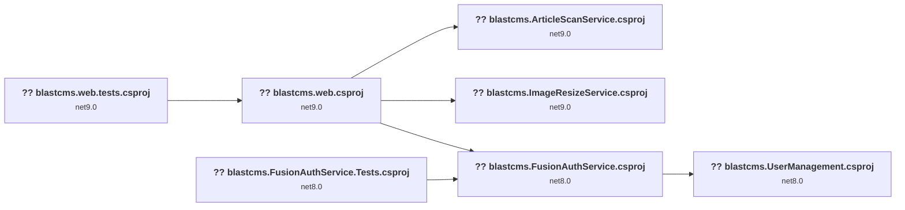

# .NET Upgrade to .NET 10 Plan

This document outlines the plan to upgrade the solution to .NET 10.

## Table of Contents

1. [Executive Summary](#1-executive-summary)
2. [Migration Strategy](#2-migration-strategy)
3. [Detailed Dependency Analysis](#3-detailed-dependency-analysis)
4. [Project-by-Project Plans](#4-project-by-project-plans)
5. [Risk Management](#5-risk-management)
6. [Testing & Validation Strategy](#6-testing--validation-strategy)
7. [Complexity & Effort Assessment](#7-complexity--effort-assessment)
8. [Source Control Strategy](#8-source-control-strategy)
9. [Success Criteria](#9-success-criteria)

## 1. Executive Summary
This document outlines the plan for upgrading the solution from various .NET versions (.NET 8 and .NET 9) to .NET 10. The migration will be performed using an **All-at-Once** strategy, where all 7 projects in the solution are upgraded simultaneously.

### Key Metrics
- **Total Projects**: 7
- **Total Lines of Code**: ~12,000
- **Dependency Complexity**: Low to Medium, with a clear dependency graph and no circular references.
- **Primary Risks**:
  - API breaking changes (Binary, Source, and Behavioral).
  - One deprecated NuGet package (`FluentValidation.AspNetCore`).

### Recommended Approach: All-at-Once
The **All-at-Once** strategy was selected due to the solution's relatively small size and well-defined project dependencies. This approach is faster and avoids the complexity of managing a multi-targeted solution during a phased migration. All framework and package updates will be performed in a single, coordinated operation.

## 2. Migration Strategy
The **All-at-Once** strategy will be employed for this upgrade. All projects will be upgraded to .NET 10 simultaneously in a single, coordinated operation.

### Rationale
- **Small Solution Size**: With only 7 projects, a simultaneous upgrade is manageable and avoids the overhead of a phased approach.
- **Clear Dependencies**: The project dependency graph is straightforward with no circular dependencies, making a single-pass upgrade feasible.
- **Efficiency**: This strategy offers the fastest path to completing the full migration.

### Execution Approach
1.  **Atomic Update**: All project files will have their `TargetFramework` updated from `net8.0` or `net9.0` to `net10.0`. All necessary NuGet package updates identified in the assessment will be applied at the same time.
2.  **Unified Build**: The entire solution will be built to identify all compilation errors at once.
3.  **Holistic Fixes**: All compilation errors resulting from framework and package upgrades will be addressed in a single phase.
4.  **Comprehensive Testing**: All test projects will be run after the solution successfully builds.

## 3. Detailed Dependency Analysis
The solution consists of 7 projects with a clear dependency flow. The `blastcms.web` project is the primary application, with several services and a test project depending on it.

### Project Relationship Graph
The following graph illustrates the dependencies between the projects in the solution:

### Project Grouping for "All-at-Once"
Since all projects will be upgraded simultaneously, they are treated as a single group. However, understanding the dependency order is crucial for troubleshooting. The logical order from fewest to most dependencies is:

1.  `blastcms.UserManagement.csproj` (0 project dependencies)
2.  `blastcms.ImageResizeService.csproj` (0 project dependencies)
3.  `blastcms.ArticleScanService.csproj` (0 project dependencies)
4.  `blastcms.FusionAuthService.csproj` (depends on `blastcms.UserManagement`)
5.  `blastcms.FusionAuthService.Tests.csproj` (depends on `blastcms.FusionAuthService`)
6.  `blastcms.web.csproj` (depends on `blastcms.ImageResizeService`, `blastcms.ArticleScanService`, `blastcms.FusionAuthService`)
7.  `blastcms.web.tests.csproj` (depends on `blastcms.web`)

## 4. Project-by-Project Plans

### 4.1 blastcms.UserManagement.csproj
**Current State**:
- Target Framework: `net8.0`
- Dependencies: 0
- Dependants: 1

**Target State**:
- Target Framework: `net10.0`

**Migration Steps**:
1.  **Update TargetFramework**: Change the `TargetFramework` property in the `.csproj` file from `net8.0` to `net10.0`.
2.  **Package Updates**: No package updates are required for this project.
3.  **Validation**:
    - [ ] Project builds successfully without errors.

### 4.2 blastcms.ImageResizeService.csproj
**Current State**:
- Target Framework: `net9.0`
- Dependencies: 0
- Dependants: 1

**Target State**:
- Target Framework: `net10.0`

**Migration Steps**:
1.  **Update TargetFramework**: Change the `TargetFramework` property in the `.csproj` file from `net9.0` to `net10.0`.
2.  **Package Updates**:
    | Package | Current Version | Target Version |
    | :--- | :---: | :---: |
    | `Microsoft.Extensions.Configuration.Abstractions` | 9.0.5 | 10.0.1 |
    | `System.Text.Json` | 9.0.0 | 10.0.1 |
3.  **Validation**:
    - [ ] Project builds successfully without errors.

### 4.3 blastcms.ArticleScanService.csproj
**Current State**:
- Target Framework: `net9.0`
- Dependencies: 0
- Dependants: 1

**Target State**:
- Target Framework: `net10.0`

**Migration Steps**:
1.  **Update TargetFramework**: Change the `TargetFramework` property in the `.csproj` file from `net9.0` to `net10.0`.
2.  **Package Updates**:
    | Package | Current Version | Target Version |
    | :--- | :---: | :---: |
    | `Microsoft.Extensions.Configuration.Abstractions` | 9.0.5 | 10.0.1 |
    | `Microsoft.Extensions.Http` | 9.0.5 | 10.0.1 |
    | `System.Text.Json` | 9.0.0 | 10.0.1 |
3.  **Expected Breaking Changes**:
    - This project has 10 potential behavioral changes related to `System.Uri`. These will need to be tested during the validation phase.
4.  **Validation**:
    - [ ] Project builds successfully without errors.
    - [ ] Runtime behavior of URI handling is verified.

### 4.4 blastcms.FusionAuthService.csproj
**Current State**:
- Target Framework: `net8.0`
- Dependencies: 1 (`blastcms.UserManagement`)
- Dependants: 2

**Target State**:
- Target Framework: `net10.0`

**Migration Steps**:
1.  **Update TargetFramework**: Change the `TargetFramework` property in the `.csproj` file from `net8.0` to `net10.0`.
2.  **Package Updates**:
    | Package | Current Version | Target Version |
    | :--- | :---: | :---: |
    | `Microsoft.Extensions.DependencyInjection.Abstractions` | 9.0.5 | 10.0.1 |
    | `Microsoft.Extensions.Options.ConfigurationExtensions` | 9.0.5 | 10.0.1 |
3.  **Validation**:
    - [ ] Project builds successfully without errors.

### 4.5 blastcms.FusionAuthService.Tests.csproj
**Current State**:
- Target Framework: `net8.0`
- Dependencies: 1 (`blastcms.FusionAuthService`)
- Dependants: 0

**Target State**:
- Target Framework: `net10.0`

**Migration Steps**:
1.  **Update TargetFramework**: Change the `TargetFramework` property in the `.csproj` file from `net8.0` to `net10.0`.
2.  **Package Updates**: No package updates are required for this project.
3.  **Validation**:
    - [ ] Project builds successfully without errors.
    - [ ] All tests pass.

### 4.6 blastcms.web.csproj
**Current State**:
- Target Framework: `net9.0`
- Dependencies: 3
- Dependants: 1

**Target State**:
- Target Framework: `net10.0`

**Migration Steps**:
1.  **Update TargetFramework**: Change the `TargetFramework` property in the `.csproj` file from `net9.0` to `net10.0`.
2.  **Package Updates**:
    | Package | Current Version | Target Version | Action |
    | :--- | :---: | :---: | :--- |
    | `FluentValidation.AspNetCore` | 11.3.0 | - | Remove (deprecated) |
    | `Microsoft.AspNetCore.Authentication.OpenIdConnect` | 9.0.0 | 10.0.1 | Update |
    | `Microsoft.AspNetCore.Cryptography.KeyDerivation` | 9.0.0 | 10.0.1 | Update |
    | `System.Text.Json` | 9.0.0 | 10.0.1 | Update |
3.  **Expected Breaking Changes**:
    - This project has the highest number of potential breaking changes (10 binary, 13 source, 8 behavioral).
    - **`Microsoft.Extensions.Configuration.ConfigurationBinder.GetValue`**: This method has binary incompatibilities. Code using this method will need to be reviewed and updated.
    - **`OpenIdConnect`**: Several properties and classes related to OpenID Connect are source incompatible. The authentication setup will need to be re-evaluated.
    - **`System.Uri`**: Behavioral changes will require testing of any URI-related functionality.
4.  **Validation**:
    - [ ] Project builds successfully without errors.
    - [ ] Application starts and runs without runtime errors.
    - [ ] Authentication and authorization workflows function correctly.
    - [ ] All major application features are manually tested and verified.

### 4.7 blastcms.web.tests.csproj
**Current State**:
- Target Framework: `net9.0`
- Dependencies: 1 (`blastcms.web`)
- Dependants: 0

**Target State**:
- Target Framework: `net10.0`

**Migration Steps**:
1.  **Update TargetFramework**: Change the `TargetFramework` property in the `.csproj` file from `net9.0` to `net10.0`.
2.  **Package Updates**:
    | Package | Current Version | Target Version |
    | :--- | :---: | :---: |
    | `Microsoft.Extensions.Caching.Memory` | 9.0.0 | 10.0.1 |
3.  **Validation**:
    - [ ] Project builds successfully without errors.
    - [ ] All tests pass.

## 5. Risk Management
The overall risk of this migration is considered **Low** due to the small number of projects and clear dependencies. The primary risks are related to API breaking changes and a deprecated package.

| Risk Category | Description | Mitigation |
| :--- | :--- | :--- |
| **API Breaking Changes** | The assessment identified 10 binary, 13 source, and 18 behavioral API incompatibilities, primarily in `blastcms.web` and `blastcms.ArticleScanService`. | Address all compilation errors after the initial upgrade. Thoroughly test all application functionality, paying close attention to areas identified in the API analysis. |
| **Deprecated NuGet Package** | `FluentValidation.AspNetCore` is deprecated. | The package will be removed. According to FluentValidation documentation, this package is no longer needed and validation can be integrated manually. |
| **Unused NuGet Package** | You have indicated that `Azure.Storage.Blobs` may no longer be in use. | I will not take any action on this package. If you wish to remove it, you can do so after the upgrade. |

## 6. Testing & Validation Strategy
A comprehensive testing strategy is crucial for the success of the **All-at-Once** migration.

### Phase 1: Build and Initial Test
1.  After all projects are upgraded, perform a full solution build.
2.  Address all compilation errors.
3.  Run all unit tests from `blastcms.FusionAuthService.Tests` and `blastcms.web.tests`. All tests must pass before proceeding.

### Phase 2: Runtime and Functional Testing
1.  Start the `blastcms.web` application.
2.  Perform a smoke test to ensure the application starts and the main pages are accessible.
3.  Execute manual tests covering the main functionalities of the application, including:
    - User authentication and authorization.
    - Content creation and management (Articles, Pages, etc.).
    - API endpoints.
    - Any functionality related to the identified behavioral changes (`System.Uri`).

## 8. Source Control Strategy
All changes will be committed to the `upgrade-to-NET10` branch. A single commit will be made after the entire upgrade is complete, the solution builds successfully, and all tests pass. This aligns with the atomic nature of the **All-at-Once** strategy.

## 9. Success Criteria
The migration will be considered successful when the following criteria are met:

### Technical Criteria
- All projects in the solution are successfully retargeted to `net10.0`.
- All required NuGet packages are updated to their specified versions.
- The `FluentValidation.AspNetCore` package is removed.
- The entire solution builds without any errors or warnings.
- All unit tests in the solution pass.

### Functional Criteria
- The `blastcms.web` application runs without any runtime errors.
- All key functionalities, especially those related to authentication and areas with potential breaking changes, are verified to be working as expected.
